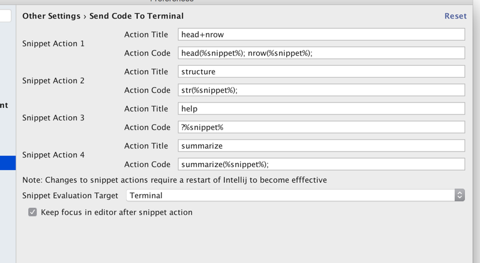
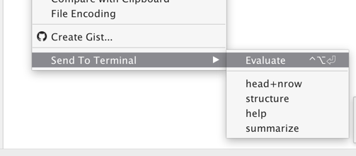

Send To Terminal
================

Intellij plugin to send line or selection to terminal  

The following modes are supported

*   Send current line
*   Send current and move focus to next line with expression
*   Send current selection

Supported evaluation targets are

*   Terminal (MacOS)
*   iTerm2 (MacOS)
*   R GUI (MacOS)
*   R GUI (Windows)

## Custom shortcut actions

Up to 4 custom actions can be defined to send the current selection/line to the evaluation target. Below some examples are shown for R

Those shortcut actions are exposed via the context menu and can be assigned to custom keyboard bindings:

## How to build?

Clone from `https://github.com/holgerbrandl/send2terminal`, open project in Intellij, and click "Run".

## Support & Development

Feel welcome to suggest features or improvments by submitting an [issue](https://github.com/holgerbrandl/send2terminal/issues)

## References

* [Official Plugin Page ](https://plugins.jetbrains.com/idea/plugin/9409-send-to-terminal) in Jetbrains` Plugin Repository